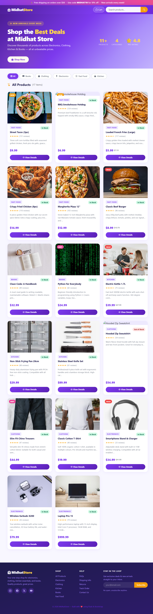
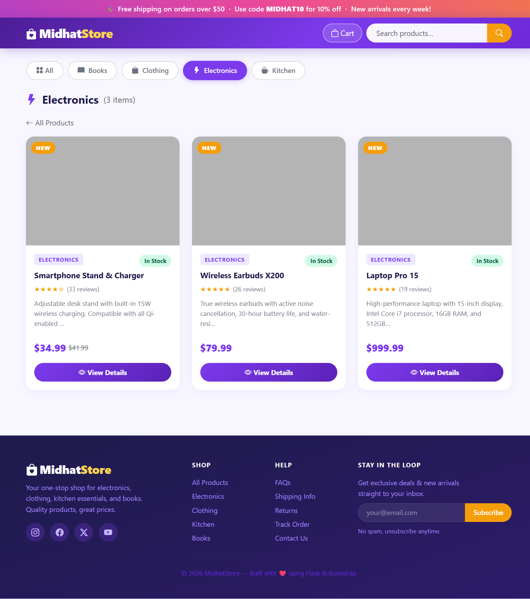
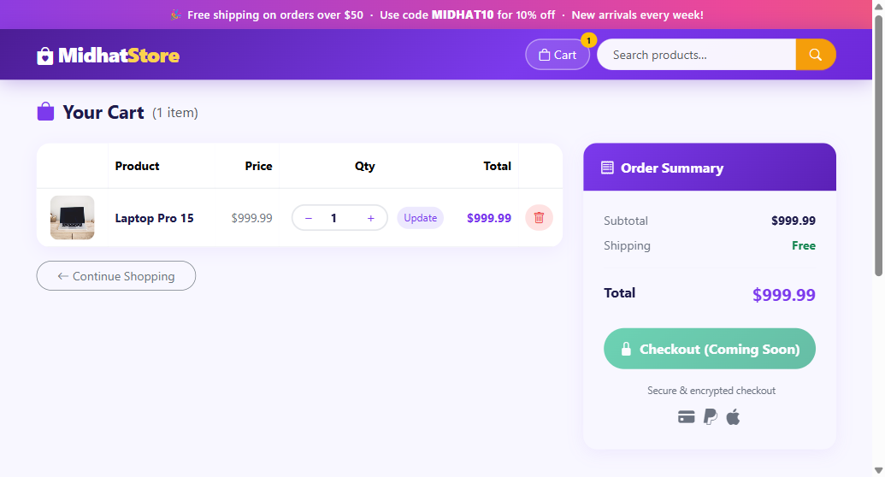

# MidhatStore - E-Commerce Web Application

A full-featured e-commerce store built with **Flask** and **SQLAlchemy**, featuring product browsing by category, product details, and a shopping cart system.

## Live Demo

**[View Live Site](https://midhatstore.onrender.com)**

## Screenshots

| Home Page | Category View | Shopping Cart |
|-----------|--------------|---------------|
|  |  |  |

## Features

- Browse products across 5 categories: **Electronics**, **Clothing**, **Kitchen**, **Books**, **Fast Food**
- Product detail pages with images and descriptions
- Shopping cart with add/remove/update quantity
- Auto-seeding database with 17 products
- Responsive premium theme design
- SQLite database (auto-created on first run)

## Tech Stack

- **Backend:** Python, Flask, Flask-SQLAlchemy
- **Database:** SQLite
- **Frontend:** HTML, CSS, Jinja2 Templates
- **Testing:** Pytest, pytest-flask

## Getting Started

### Prerequisites

- Python 3.9+

### Installation

```bash
# Clone the repository
git clone https://github.com/midhatnayab7-creator/MidhatStore.git
cd MidhatStore

# Create virtual environment
python -m venv .venv
source .venv/bin/activate  # On Windows: .venv\Scripts\activate

# Install dependencies
pip install -r requirements.txt

# Run the application
python run.py
```

The app will be available at **http://localhost:5000**

### Running Tests

```bash
pytest
```

## Project Structure

```
MidhatStore/
├── app/
│   ├── __init__.py          # App factory
│   ├── models.py            # Product model
│   ├── routes/
│   │   ├── catalog.py       # Product browsing routes
│   │   └── cart.py          # Shopping cart routes
│   ├── templates/           # Jinja2 HTML templates
│   └── static/images/       # Product images
├── seeds/
│   └── products.py          # Database seed data
├── tests/                   # Test suite
├── requirements.txt
└── run.py                   # Entry point
```

## Categories

| Category | Products |
|----------|----------|
| Electronics | Laptop Pro, Earbuds X200, Phone Charger |
| Clothing | T-Shirt, Hoodie, Chino Trousers |
| Kitchen | Frying Pan, Kettle, Knife Set |
| Books | Clean Code, Python Book |
| Fast Food | Burger, Pizza, Hotdog, Tacos, French Fries, Fried Chicken |

## Author

**Midhat Nayab** - [GitHub](https://github.com/midhatnayab7-creator)

---

Built with Flask
